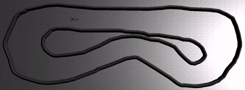
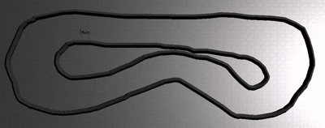

# RL Control for Autonomous Racing

This package contains reinforcement learning (RL) implementations for autonomous racing in the AutoDRIVE simulator. It includes two main approaches: waypoint-based training and generalized track-agnostic training, along with a demo runner for testing pre-trained models.

## Components

### 1. Waypoint-Based Training (`rl_agent_node.py`)
- **Purpose**: Trains an RL agent to follow waypoints from global-planning on a specific track.
- **Features**:
  - Uses Lidar (36 points), speed, IMU (10 readings), and IPS (position) data.
  - Incorporates trajectory tracking rewards based on loaded waypoints.
  - Action space: Steering [-1, 1] and Throttle [-1, 1].
  - Observation space: 36 (Lidar) + 1 (Speed) + 10 (IMU) + 3 (IPS) = 50 dimensions.
- **Training**: Run the script directly to train a new PPO model with waypoint tracking.

### 2. Generalized RL Model (`rl_general.py`)
- **Purpose**: Trains a track-agnostic RL agent that can generalize to any track layout.
- **Features**:
  - Uses only local sensor data: Lidar (72 points), speed, and IMU (10 readings).
  - No position (IPS) data to ensure track independence.
  - Focuses on speed optimization while avoiding obstacles.
  - Action space: Steering [-1, 1] and Throttle [-1, 1].
  - Observation space: 72 (Lidar) + 1 (Speed) + 10 (IMU) = 83 dimensions.
- **Training**: Run the script directly to train a new PPO model for generalized driving.

### 3. Demo Runner (`demo_runner.py`)
- **Purpose**: Loads and runs pre-trained models in the simulator for demonstration.
- **Features**:
  - Supports deterministic predictions for consistent performance.
  - Automatically resets episodes on termination.
  - Can be stopped with Ctrl+C.

## Training the Models

### Prerequisites
- ROS 2 environment set up.
- AutoDRIVE simulator running.
- Required Python packages: Install via `pip install -r requirements.txt`.

### Training Waypoint-Based Model
1. Ensure waypoints are available (e.g., `.../ros2_ws/src/roboracer-autodrive/planner/global-planning/outputs/map5/ay_safe_2.csv`).
2. Run: `ros2 run rl_control rl_train`
   - This will train a new PPO model and save checkpoints every 40,000 timesteps.
   - Final model saved to `models/PPO_final.zip`.

### Training Generalized Model
1. Run: `ros2 run rl_control rl_general`
   - Trains without track-specific data.
   - Saves checkpoints every 50,000 timesteps.
   - Final model saved to `models/rl_general_model.zip`.

Training can be interrupted with Ctrl+C, and the model will be saved.

## Checking Pre-trained Models

Pre-trained models are stored in the `models/` folder. To test a model:

1. **Select a Model**: Choose from available models in `models/`, e.g., `ppo_autodrive_wp.zip` or `rl_general_model.zip`.

2. **Update Demo Runner**: Edit `demo_runner.py` to load your desired model:
   ```python
   model_name = "ppo_autodrive_wp.zip"  # or "rl_general_model.zip"
   ```

3. **Run the Demo**:
   - Ensure the AutoDRIVE simulator is running.
   - Execute: `ros2 run rl_control demo_runner`
   - Press Enter when prompted to start.
   - The car will drive autonomously using the loaded model.
   - Stop with Ctrl+C.

## Demonstrations

Here are visuals demonstrating the car's performance under different algorithms.

### Waypoint-Based Algorithm


### Generalized Algorithm


> **Performance note:** The behaviours shown above are not good enough. The trained models still struggle with consistency and speed; they need additional training time and reward/hyperparameter tuning to improve lap performance.

## Logs and Monitoring
- Training logs are saved to `tensorboard_logs/`.
- Use TensorBoard to monitor training progress: `tensorboard --logdir tensorboard_logs/`.
